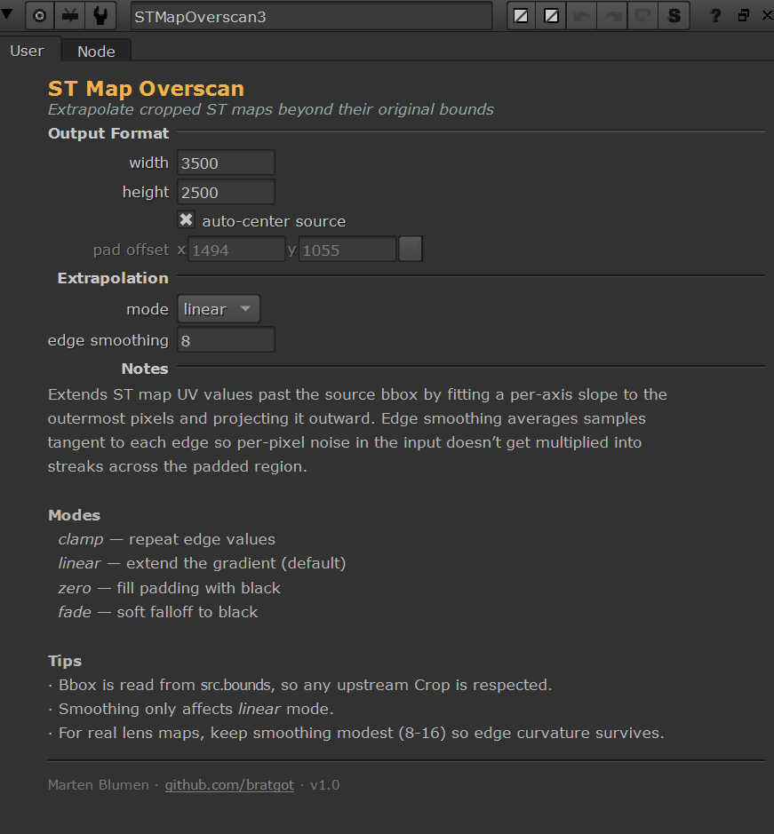

# STMapExtension

A Nuke tool for **uncropping ST maps** — extending UV values past their original bbox by extrapolating the gradient outward.

When an ST map gets cropped (so its data window no longer covers full 0..1 in U and V), downstream STMap nodes can't sample beyond the bbox edges. This tool reconstructs plausible UV values for the padded region by fitting per-axis functions to the outermost trusted pixels and projecting them outward, with smoothing to suppress noise amplification.



## Features

- BlinkScript GPU implementation, runs at viewer speed
- Four extrapolation modes: `clamp`, `linear`, `zero`, `fade`
- **Linear or quadratic order** — handles real lens distortion curvature, not just constant gradients
- **Edge trim** with uniform, per-edge override, and auto-detect modes — replace unreliable edge pixels with synthetic values
- Edge smoothing knob to suppress noise streaks
- Auto-centering of source within target canvas
- Reads source bbox from `src.bounds` — no manual size sync needed
- Self-contained Group node, no external dependencies

## Installation

### Quick start

1. Clone this repo:
   ```bash
   git clone https://github.com/bratgot/STMapExtension.git
   ```
2. In Nuke's Script Editor:
   ```python
   exec(open('/path/to/STMapExtension/install.py').read())
   ```

The first run writes the kernel to `~/.nuke/STMapOverscan_kernel.rpp` and creates a new `STMapOverscan1` group node.

### Persistent menu install

Copy `install/menu.py.example` into your `~/.nuke/menu.py`, edit `STMAP_INSTALL_PATH` to point at your clone, and you'll get a menu entry plus an `Shift+O` hotkey.

## Usage

1. Connect a cropped ST map to the input
2. Set `width` / `height` on the **Output Format** section to the target uncropped size
3. Pick an extrapolation `mode` (default: `linear`)
4. Pick an `order`: `1` (linear) for clean gradients, `2` (quadratic) for curving lens distortion
5. Adjust `edge smoothing` if you see streak artifacts (default: `8`, sweet spot: `8`–`16`)
6. If the input has bad edges (black bleeds, ringing), set `edge trim` values or click **Auto-Analyze Edges**

## How it works

For each output pixel:

1. Find the corresponding source-space coordinate (subtract pad offset)
2. If inside the trusted region → sample directly
3. If outside → walk to the nearest edge of the trusted region, fit a function from a `smoothing`-pixel baseline averaged along the tangent, project it outward
4. Order 1 fits a straight line (first-order Taylor); order 2 fits a parabola (second-order Taylor)

The tangent-direction averaging is the key to clean output. A slope built from just two pixels turns per-pixel noise in the source into multi-thousand-pixel streaks across the padded region; averaging the edge samples first keeps the estimate stable.

The kernel reads `src.bounds` in `init()` so the data window is auto-detected at every cook — no manual size knobs to keep in sync.

See [`docs/HOW_IT_WORKS.md`](docs/HOW_IT_WORKS.md) for the math walkthrough.

## Modes

| Mode | Behavior |
|------|----------|
| `clamp` | Repeat edge values into the padded region |
| `linear` | Extrapolate using order 1 (line) or order 2 (parabola) |
| `zero` | Fill padding with black |
| `fade` | Soft falloff from edge values to black |

## Order

| Order | Description | Best for |
|-------|-------------|----------|
| 1 | First-order Taylor (straight line) | Linear gradients, mild distortion |
| 2 | Second-order Taylor (parabola) | Wide-angle, fisheye, anamorphic distortion |

Order 2 is exact for quadratic fields and a good approximation for general curving fields. The trade-off is sensitivity to noise — quadratic curvature gets amplified by `Δ²`, so quadratic mode benefits from `smoothing ≥ 4`.

## Edge Trim

Many real ST maps have unreliable outermost pixels — black borders from incomplete renders, anti-aliasing softness, or upstream interpolation artifacts. The trim controls let you replace those pixels with synthetic edge values:

- **Uniform trim**: trim N pixels from all four edges
- **Per-edge override**: enable to set independent trim for left/right/top/bottom
- **Auto-Analyze Edges**: samples the input, fits a linear trend to interior values, identifies where the outer pixels deviate from that trend, and sets per-edge trim automatically

Trimmed pixels behave the same as out-of-bbox pixels — they get extrapolated from the trusted interior.

## Files

```
STMapExtension/
├── install.py                     # main installer (run in Nuke)
├── kernel/
│   └── STMapOverscan_kernel.rpp   # standalone BlinkScript kernel
├── install/
│   └── menu.py.example            # menu.py snippet for studio install
├── examples/
│   └── STMapCropped.exr           # test ST map (linear unit gradient)
├── docs/
│   ├── HOW_IT_WORKS.md
│   └── images/
├── LICENSE
├── CHANGELOG.md
└── README.md
```

## Caveats

Quadratic extrapolation is exact for quadratic fields and approximates higher-order distortion well for moderate distances. For very strong distortion projected very far past the bbox, errors still grow — the curvature itself isn't constant in real lenses, so even a parabola eventually drifts. Cubic order would be the next upgrade if needed.

The auto-analyze edge detection is heuristic. It works well for obvious cases (visible black borders, abrupt gradient breaks) but can miss subtle edge softness. Manual trim values are always available as a fallback.

## Compatibility

Tested on Nuke 14.1+. Should work on any Nuke with BlinkScript GPU support.

## License

MIT — see [LICENSE](LICENSE).

## Credit

Built by [Marten Blumen](https://github.com/bratgot).
